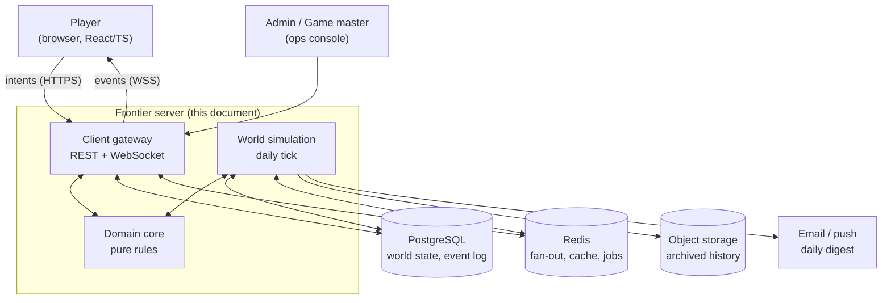
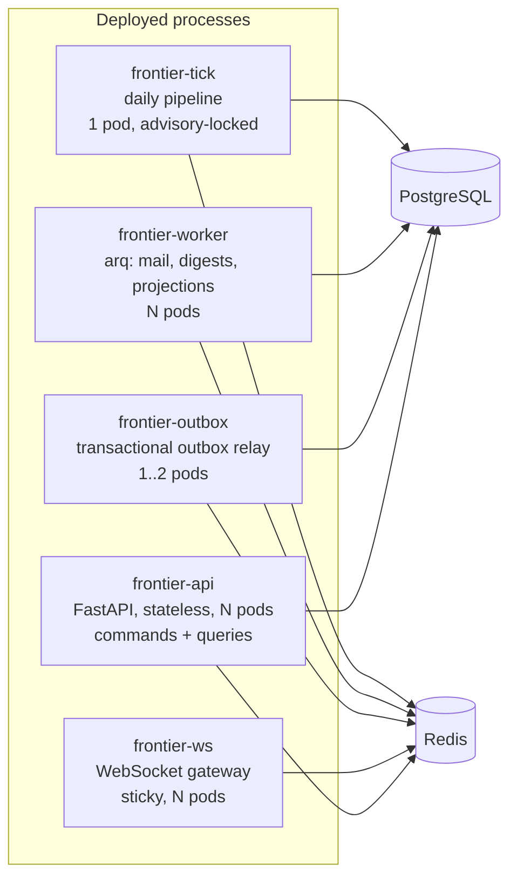

# Software Architecture Document

## *Frontier: The Seldon Era* — Python Reference Implementation

| Field | Value |
| --- | --- |
| Status | Draft for review |
| Version | 0.4 |
| Date | 2026-08-27 |
| Supersedes | 0.1 |
| Normative source | `Documentations/game-design.md` v2.5 (cited as §n) |
| Companion | `Documentations/detailed-design-mvp.md` — MVP detail for phases P0–P3 |
| Audience | Server, client and infrastructure engineers; technical reviewers |

### How to read this document

The game design document is **normative for behaviour**; this document is **normative for structure**. Where the two
disagree, the design document wins and this document must be amended. Every significant choice is recorded as an
architecture decision (`[ADR-n]`), collected in section 19. Section 21 maps design-document sections to the components that
realise them.

---

# 1. Architectural drivers

## 1.1 Functional drivers

| # | Driver | Source | Architectural consequence |
| --- | --- | --- | --- |
| F1 | One world tick per 24 h; players act asynchronously against an Action Point budget | §3.2, §3.4 | A batch simulation process distinct from the request path; AP as a first-class, audited resource |
| F2 | The browser is untrusted; the server owns all state | §10.4 C1 | Intent-based command API; no client-authored state transitions; server clock only |
| F3 | One hierarchical hex world, addressed at several scales at once | §2 | A single coordinate value object and a containment-queryable location tree |
| F4 | Chat and world events share one model, with spatial scope and lifetime | §7.6–§7.8 | An append-only event spine that every other module publishes to and reads from |
| F5 | Interactions must resolve while a participant is offline | §3.5 | Standing-orders records plus server-side encounter resolution during the tick |
| F6 | Visibility depends on location, sensors and infrastructure; comms have range and optional delay | §7.4–§7.5, §7.1, §10.4 C5 | Audience resolution and per-viewer redaction as a single shared service; streamed map read models |
| F7 | Psychohistory predicts populations, never individuals | §8.2–§8.4 | A bounded context whose only inputs are aggregates, enforced at the database-role level |
| F8 | A fourth faction exists whose membership must not be publicly discoverable | §9 | Clearance-based authorisation, separate schema, and a dedicated anti-leak test suite |
| F9 | Balance values (AP costs, prices, ranges) change constantly | §3.2 | Versioned rule data outside code, stamped onto every event for replay fidelity |
| F10 | The galaxy is populated and keeps evolving where nobody is looking | §2.7 | Two-tier population: aggregate flows everywhere, individual NPCs only where observed |

## 1.2 Quality attributes

Ranked. Where two conflict, the higher-ranked one wins.

1. **Integrity** — no player may gain AP, credits, cargo or position outside a validated server transition. A bug that
   loses a message is recoverable; a bug that mints credits corrupts the persistent world permanently.
2. **Secrecy** — Continuity membership must not leak through any response, error code, timing difference or feed.
   A leak is unrecoverable: the social game (§9.7, §9.4) cannot be un-spoiled.
3. **Determinism and auditability** — any tick or combat resolution must be reproducible from stored inputs, so
   disputes are answerable and the historical record (§8.10) is trustworthy.
4. **Evolvability** — §10.2 lists a dozen systems deliberately deferred. The architecture is judged on how cheaply they
   attach later.
5. **Latency** — a command should feel immediate (p95 < 150 ms), but the game is asynchronous by design; this ranks
   below the above.
6. **Throughput/cost** — a 24 h cycle is an enormous budget. Optimise last, and only with measurements.

## 1.3 Constraints

- Python 3.12+ server, browser client in React/TypeScript over HTTPS and WebSocket, PostgreSQL of record (§10.4).
- Single logical world per deployment ("shard"); multi-world is a deployment concern, not a code concern.
- Original IP only — no assets, names or data copied from *Frontier: Elite II* or Asimov's works (§1.7, §8.1).
- The Continuity confidentiality protocol is a role-play mechanic and must never be implemented as an enforceable
  legal agreement (§9.3).

---

# 2. System context



The player is the only untrusted actor. Everything inside the boundary trusts the database as the record of truth and
the domain core as the arbiter of legality.

---

# 3. Architectural style and principles

**Style: hexagonal (ports and adapters) around a pure domain core, with CQRS-flavoured read models and an
append-only event spine.** `[ADR-3]` `[ADR-4]`

The design document forces this shape rather than merely permitting it:

- §10.4 C2 requires the simulation to be independent of the browser client — so the rules cannot live in HTTP handlers.
- §10.4 C1 makes the server the sole authority — so there is exactly one place where a transition is judged legal.
- §7.6 makes one event stream feed chat, missions, economy, factions, history and statistics — so subsystems must not
  call each other directly; they publish and subscribe.
- §8.10 requires a persistent history — so the event log is a product, not a debug artefact.

## 3.1 Layering rules

```text
 adapters/  ──depends on──▶  application/  ──depends on──▶  domain/
 (FastAPI, SQLAlchemy,        (use cases, ports,             (pure rules, no I/O,
  Redis, WS, email)            unit of work)                  no imports outward)
```

Enforced mechanically, not by convention:

- `domain/` may import only the standard library and `attrs`/`dataclasses`. A lint rule (`ruff` `flake8-tidy-imports`
  banned-module-patterns) fails the build on any import of `sqlalchemy`, `fastapi`, `redis`, `httpx` or `datetime.now`.
- `application/` depends on `domain/` and on **protocols** (`typing.Protocol`) for repositories, clock, RNG and bus.
- `adapters/` implements those protocols. Nothing imports `adapters/` except the composition root
  (`frontier/config/container.py`) and tests.

## 3.2 Core principles

| Principle | Meaning in this codebase |
| --- | --- |
| **No state change without an event** | Every committed transaction that mutates world state also appends ≥1 row to `events`. Asserted in tests by a session-level SQLAlchemy hook. |
| **Intents in, events out** | The client posts what it wants to do; it never posts a result. The response is the accepted command plus the events the caller is allowed to see. |
| **Determinism by injection** | No `datetime.now()`, no module-level `random`. Time and randomness arrive through `ClockPort` and `RngPort`. `[ADR-6]` |
| **Data over code for balance** | AP costs, prices, ranges and probabilities live in versioned TOML rulesets. `[ADR-10]` |
| **Deny by default in projections** | Serialisers are explicit allowlists. `model_dump()` of an ORM object never reaches a response. `[ADR-13]` |
| **One place for visibility** | A single `resolve_audience()` / `render_for()` pair decides who sees what. No module filters events on its own. `[ADR-7]` |

---

# 4. Technology stack

| Concern | Choice | Rationale | Rejected |
| --- | --- | --- | --- |
| Language | **Python 3.12+**, `from __future__ import annotations`, `mypy --strict` on `domain/` and `application/` | Constraint. Strict typing is what makes a large rule engine tractable in Python. | — |
| Web framework | **FastAPI** (ASGI, Uvicorn workers under Gunicorn) | Native async, WebSocket support, Pydantic v2 request validation, OpenAPI generation the TS client consumes. | Django (ORM-centric, sync-first, fights the pure-core layering); Litestar (fine, smaller ecosystem) |
| Wire validation | **Pydantic v2** at the edge only | Rust-backed validation of untrusted input (F2). Kept out of the domain: hot-loop objects are frozen slotted dataclasses. | Pydantic everywhere (allocation cost in tick loops) |
| Persistence | **SQLAlchemy 2.0 async ORM** + **Alembic** | Typed models, explicit unit of work, mature migrations. | Raw asyncpg (hand-rolled mapping); Tortoise/Piccolo (thinner ecosystem) |
| Database | **PostgreSQL 16** | Fixed by the project brief. Also supplies `ltree` (hierarchy), `jsonb` (payloads), declarative partitioning (event log), advisory locks (tick), `SKIP LOCKED` (queues). | — |
| Cache / bus | **Redis 7** | WebSocket fan-out, presence, rate limiting, idempotency keys, job broker. | Postgres `LISTEN/NOTIFY` alone (no payload size headroom, no consumer groups) |
| Background jobs | **arq** | Async-native, Redis-backed, small. Matches an asyncio codebase without Celery's sync bridge. | Celery (heavier, sync-oriented); Dramatiq |
| Tick scheduler | **Kubernetes CronJob** (or systemd timer) → `frontier-tick` process, guarded by a Postgres advisory lock | The tick is a batch pipeline, not a queue task; it must run exactly once and be resumable. `[ADR-8]` | Celery beat (no exactly-once guarantee) |
| Numerics | **NumPy** in economy and psychohistory stages only | Vectorises the O(world) parts of the tick; keeps pure-Python loops off the critical path. | Pandas (heavy, unneeded); pure Python (see risk R1) |
| Packaging / tooling | **uv**, **ruff** (lint + format), **mypy**, **pytest** | Fast, single-tool lint/format; uv keeps CI installs in seconds. | poetry + black + flake8 + isort |
| Testing | pytest, pytest-asyncio, **Hypothesis**, **testcontainers-python**, polyfactory | Property tests for hex algebra and AP invariants; real PostgreSQL in integration tests. | SQLite for tests (diverges on `ltree`, partitioning, locking) |
| Observability | structlog (JSON), OpenTelemetry, Prometheus client | Correlate command → events → tick stage. | print/logging ad hoc |

---

# 5. Container and process view



| Process | Cardinality | Responsibility | Failure behaviour |
| --- | --- | --- | --- |
| `frontier-api` | horizontal, stateless | Authentication, command handling, read-model queries | Lost pod costs in-flight requests only; commands are idempotent and retryable |
| `frontier-ws` | horizontal, sticky sessions | WebSocket sessions, subscription authorisation, Redis→client relay | Client reconnects and replays from its last event cursor |
| `frontier-outbox` | 1 active (leader-elected) | Reads `events_outbox`, publishes to Redis channels, marks sent | At-least-once delivery; clients de-duplicate on `event_id` |
| `frontier-worker` | horizontal | Digest mail, projection rebuilds, archive export | Jobs are idempotent and re-queued |
| `frontier-tick` | exactly 1 per world-day | The daily simulation pipeline | Resumable from the last completed stage; see section 9.3 |

The API process must never run simulation stages, and the tick must never serve requests. The two have opposite
profiles — many short transactions versus one long, CPU-heavy, world-wide pass — and sharing a pod makes the daily
cycle visible as latency to every player.

---

# 6. Module view (bounded contexts)

Each context owns its tables, exposes a Python-level façade, and communicates outward only through events.

| # | Context | Package | Owns | Publishes | Design ref |
| --- | --- | --- | --- | --- | --- |
| 1 | Identity | `frontier.identity` | accounts, sessions, credentials | `ACCOUNT_*` | — |
| 2 | Cartography | `frontier.world` | location tree, hex algebra, planets, stations | `DISCOVERY` | §2 |
| 3 | Fleet | `frontier.fleet` | ships, modules, cargo, fuel, docking | `SHIP_*`, `SHIP_ENTERED` | §4.2, §5.1 |
| 4 | Turn | `frontier.turn` | AP ledger, daily grant, standing orders | `TURN_*` | §3.2, §3.5 |
| 5 | Economy | `frontier.economy` | commodities, station markets, price model | `TRADE_EVENT`, `SHORTAGE` | §5.3 |
| 6 | Encounter | `frontier.encounter` | combat resolution, boarding, escape | `COMBAT_*`, `SHIP_DESTROYED` | §5.4, §3.5 |
| 7 | Population | `frontier.npc` | NPC agents, aggregate system activity, archetype behaviour | — (acts through shared commands) | §2.7 |
| 8 | Missions | `frontier.missions` | offers, stages, completion | `MISSION_*` | §5.5 |
| 9 | Polity | `frontier.polity` | factions, teams, territory, reputation, defection | `TERRITORY_CHANGE`, `FACTION_WAR` | §6 |
| 10 | Comms | `frontier.comms` | channels, radio range, relays, delay | `MESSAGE` | §7.3–§7.5 |
| 11 | Event spine | `frontier.events` | event model, audience, outbox, feeds | — (substrate) | §7.6–§7.8 |
| 12 | Chronicle | `frontier.chronicle` | promoted permanent history, archives | `HISTORICAL_EVENT` | §8.10 |
| 13 | Psychohistory | `frontier.psychohistory` | aggregate variables, forecasts | `FORECAST_PUBLISHED` | §8.2–§8.5 |
| 14 | Continuity | `frontier.continuity` | hidden membership, clearance, secret ops | clearance-scoped only | §9 |
| 15 | Gateway | `frontier.adapters.api`, `.ws` | HTTP/WS surface, projections | — | §10.4 C5 |

Dependency rules between contexts:

- Cartography is a leaf: it depends on nothing and everything may depend on it.
- Population depends on Economy, Fleet and Encounter but nothing depends on Population: NPCs are simulated
  through the same commands players use, so no other context needs to know they exist.
- The event spine is substrate: any context may publish to it; only Gateway, Chronicle and Psychohistory read broadly.
- **No context imports `frontier.continuity`.** The hidden faction attaches through the same public extension points
  as anything else (event subscriptions, mission providers, intervention hooks). If Economy had to know Continuity
  exists, every code reader would learn the secret and so would every stack trace. `[ADR-13]`
- Psychohistory imports no other context's ORM models; it reads aggregate views only. `[ADR-12]`

---

# 7. Domain core

## 7.1 Hierarchical coordinates

§2.3 requires an object to hold a position at several scales simultaneously, and §2.6 warns that a hex means a different
physical distance at each level. Both are encoded in the type system so that a category error cannot compile.

```python
# frontier/domain/hex/coordinates.py
from __future__ import annotations
from dataclasses import dataclass
from enum import IntEnum

class Level(IntEnum):
    GALAXY = 0
    REGION = 1
    SYSTEM = 2
    PLANET = 3          # planet or moon
    SECTOR = 4      # named area of a planet
    LOCAL = 5

@dataclass(frozen=True, slots=True)
class Axial:
    """Axial hex coordinate within one level."""
    q: int
    r: int

    @property
    def cube(self) -> tuple[int, int, int]:
        return self.q, self.r, -self.q - self.r

@dataclass(frozen=True, slots=True)
class HexAddr:
    """A full multi-scale address: one Axial per level, galaxy-first."""
    steps: tuple[Axial, ...]

    @property
    def level(self) -> Level:
        return Level(len(self.steps) - 1)

    def parent(self) -> HexAddr | None: ...
    def contains(self, other: HexAddr) -> bool: ...
    def ltree(self) -> str: ...                          # 'ga124_87.re3_1.sy31_14'
```

Rules the core enforces:

- `distance(a, b)` raises `ScaleMismatch` unless `a.level == b.level` **and** `a.parent() == b.parent()`. Distances
  are only meaningful among siblings; there is no cross-level metric (§2.6).
- Containment is a prefix test, which is also how it is queried in SQL — see section 10.2.
- The number of levels is configuration, not a hard-coded 6. `Level` is generated from the active ruleset so that
  adding an intermediate scale is a data change (§2.2: the number of levels is configuration and may change).
- Negative axials serialise with an `n` prefix (`q=-3 → n3`) because `ltree` labels accept only `[A-Za-z0-9_]`.

Hex algebra (neighbours, ring, spiral, line-of-sight, range) lives in `frontier/domain/hex/geometry.py`, is pure, and
is covered by Hypothesis property tests (section 13.2).

## 7.2 The event spine

One model serves chat, combat, discovery, economy and history (§7.6).

```python
# frontier/domain/events/model.py
class Scope(IntEnum):          # §7.7 — ordered, propagates upward
    LOCAL = 0; PLANET = 1; SYSTEM = 2; REGION = 3; UNIVERSE = 4

class Visibility(StrEnum):     # who may ever see it, before sensors
    PUBLIC = "public"          # anyone whose subscription covers the scope
    PARTICIPANTS = "participants"
    TEAM = "team"
    FACTION = "faction"
    CLEARANCE = "clearance"    # §9 — Continuity tiers

@dataclass(frozen=True, slots=True)
class Event:
    id: UUID                   # UUIDv7: time-ordered, safe as a cursor
    world_day: int
    occurred_at: datetime      # server clock only
    type: EventType            # COMBAT_STARTED, MESSAGE, TRADE_EVENT, ...
    origin: HexAddr
    scope: Scope               # §7.7 — how far it carries
    visibility: Visibility
    clearance: int             # 0 for everything non-Continuity
    severity: Severity         # drives promotion and lifetime (§7.8)
    participants: frozenset[ActorRef]
    payload: Mapping[str, Any] # typed per event type, stored as jsonb
    ruleset_version: str       # what rules produced it (§10.4 C7, [ADR-10])
    causation_id: UUID | None
```

Two derived behaviours fall out of the model rather than being coded per feature:

**Promotion (§7.7).** A stage of the tick re-scores accumulated events per location; when severity crosses a
ruleset threshold, a new event is emitted at the next scope up with a `causation_id` chain back to its causes.
Local skirmish → planetary conflict → system war → historical event is therefore data, not a bespoke pipeline.

**Lifetime (§7.8).** `retention_days` is a function of `(scope, severity)` read from the ruleset. A retention job
deletes expired partitions wholesale; anything the Chronicle has promoted is copied first and kept forever (§8.10).

Chat is not special: a player message is an `Event` of type `MESSAGE` whose `scope` is the channel's scope and whose
payload carries the text. This is what lets the client render one merged feed (§7.9) from one query. `[ADR-4]`

## 7.3 Action points and the transactional ledger

AP is the game's scarcity mechanism (§3.2) and therefore its primary anti-cheat control. It is modelled as an
append-only ledger, never as a mutable counter alone.

```sql
CREATE TABLE ap_ledger (
    id          bigserial PRIMARY KEY,
    player_id   uuid NOT NULL REFERENCES players(id),
    world_day   int  NOT NULL,
    delta       int  NOT NULL,          -- +grant, -spend
    reason      text NOT NULL,          -- 'daily_grant', 'action', 'refund'
    command_id  uuid REFERENCES commands(id),
    created_at  timestamptz NOT NULL DEFAULT now()
);
CREATE UNIQUE INDEX ap_ledger_command_uniq ON ap_ledger (command_id) WHERE command_id IS NOT NULL;
```

`players.ap_balance` is a cached column with `CHECK (ap_balance >= 0)`, updated in the *same transaction* as the
ledger insert. The unique index on `command_id` makes a retried command a no-op rather than a double spend, and the
`CHECK` turns any arithmetic bug into a failed transaction instead of a corrupt world. A nightly reconciliation job
asserts `sum(delta) = ap_balance` per player and alarms on drift.

Costs never appear as literals in handlers; they are read from `RuleSet.ap_cost(action, context)` `[ADR-10]`, which
lets §3.2's "exact costs are balancing parameters" be true in practice.

## 7.4 Visibility, audience and redaction

§7.1 makes information itself a mechanic, and §9.4 makes one class of information a hard security boundary. Both are
served by one pair of functions, and by nothing else in the codebase. `[ADR-7]`

```python
def resolve_audience(event: Event, world: WorldSnapshot) -> AudienceSpec:
    """Who *may* receive this event at all."""

def render_for(viewer: ViewerContext, event: Event, world: WorldSnapshot) -> EventView | None:
    """What this specific viewer sees — or None if nothing."""
```

`render_for` returns a *redacted* view, which is how sensor quality becomes gameplay rather than a boolean:

| Viewer situation | Rendered result |
| --- | --- |
| In radio range, good sensors | Full event: actor name, ship class, exact hex |
| In range, weak sensors | `"Unidentified contact"`, hex fuzzed to ring radius 2 |
| Out of range, relay coverage | Delayed and summarised (§7.5) |
| Not entitled | `None` — the event does not exist for them |

Redaction happens server-side, before serialisation. The client is never sent a field it is meant not to show.

### Fan-out strategy `[ADR-5]`

| Audience size | Strategy | Mechanism |
| --- | --- | --- |
| Narrow — participants, team, local hex, Continuity cell | **Fan-out on write** | Rows in `event_deliveries (recipient_id, event_id, read_at)`; gives unread counts and per-player cursors cheaply |
| Broad — system, region, faction, universe | **Fan-out on read** | Client queries `events` by `origin_path <@ subscription_path`; live copies arrive over a Redis channel per scope |

The threshold is a ruleset value. Writing a universe announcement to 50 000 delivery rows to obtain an unread badge is
a bad trade; writing 4 rows for a boarding action is a good one.

---

# 8. Runtime view: command execution

Every player action follows one path. There are no shortcuts for "simple" actions.

```mermaid
sequenceDiagram
    autonumber
    participant C as Browser
    participant A as frontier-api
    participant D as Domain core
    participant P as PostgreSQL
    participant O as Outbox relay
    participant W as frontier-ws

    C->>A: POST /commands {action:"move", destination:[17,22], idempotency_key}
    A->>A: Pydantic parse + authn + rate limit
    A->>P: BEGIN; SELECT ... FOR UPDATE (player row)
    A->>P: load ship, location, ruleset
    A->>D: MoveCommand.check(state, ruleset)
    D-->>A: Legal(cost=1 AP, 3 fuel)  |  Rejected(reason)
    A->>P: insert ap_ledger, update ship, insert events, insert events_outbox
    A->>P: COMMIT
    A-->>C: 202 {accepted, events_visible_to_me}
    O->>P: poll events_outbox (FOR UPDATE SKIP LOCKED)
    O->>W: publish to Redis scope channels
    W-->>C: live event (redacted per viewer)
```

Notes on the steps that matter:

- **`SELECT ... FOR UPDATE` on the player row (step 3)** serialises all commands for one player. Two browser tabs
  spending the last AP simultaneously is a routine occurrence, not an edge case. Cross-player interactions take the
  two player rows in a canonical order (ascending UUID) to avoid deadlock. `[ADR-9]`
- **`check` is pure (step 6).** It receives an immutable state snapshot and the ruleset, and returns a decision. It
  performs no I/O, which is what makes it property-testable and reusable inside the tick.
- **Events are written in the same transaction as the state change (step 7)**, together with an outbox row. Publishing
  to Redis *after* commit, from a separate process, removes the dual-write failure mode where a client is told about
  an event that was rolled back. `[ADR-11]`
- **The 202 response contains only what the caller may see**, produced by `render_for`. The command response and the
  live feed go through the same redaction code.

**Command envelope.** Every request carries an `idempotency_key` (client UUID). `commands` stores
`(player_id, idempotency_key)` unique; a replay returns the original outcome. This makes retry-on-timeout safe on a
mobile connection, which the daily-turn format makes common.

---

# 9. Runtime view: the daily tick

## 9.1 Requirements

The tick advances the world while players are absent (§1.2) and must be: exactly-once per world-day, resumable after a
crash, deterministic given the same inputs, and observable stage by stage.

## 9.2 Structure

```python
# frontier/simulation/tick.py
STAGES: tuple[Stage, ...] = (
    SettleTravel(),          # 1
    ResolveEncounters(),     # 2
    EconomyStep(),           # 3
    NpcAndFactionAI(),       # 4  (MVP builds the NPC half only)
    TerritoryRecompute(),    # 5
    MissionLifecycle(),      # 6
    PsychohistoryUpdate(),   # 7
    ContinuityInterventions(),  # 8  (loaded via entry point, see 9.4)
    EventPromotion(),        # 9
    ChronicleAndRetention(), # 10
    GrantActionPoints(),     # 11
    RebuildProjections(),    # 12
    DispatchDigests(),       # 13
)
```

| # | Stage | Reads | Writes | Design ref |
| --- | --- | --- | --- | --- |
| 1 | Settle travel | in-flight movements | arrivals, fuel, `SHIP_ENTERED` | §5.1 |
| 2 | Resolve encounters | queued contacts, standing orders | combat outcomes, wrecks, bounties | §5.4, §3.5 |
| 3 | Economy step | markets, production, shortages | prices, stock, `TRADE_EVENT`, `SHORTAGE` | §5.3 |
| 4 | NPC & faction AI | activity aggregates, observed systems | aggregate flows, materialised NPCs, NPC actions | §2.7 |
| 5 | Territory recompute | presence, influence | territory ownership, `TERRITORY_CHANGE` | §6.6 |
| 6 | Mission lifecycle | faction needs, events | offers created/expired | §5.5 |
| 7 | Psychohistory update | **aggregates only** | history variables, forecasts | §8.2, §8.3 |
| 8 | Continuity interventions | clearance-scoped state | intervention budget, agent taskings | §9 (O(world), see 20) |
| 9 | Event promotion | the day's events | promoted higher-scope events | §7.7 |
| 10 | Chronicle & retention | promoted events | permanent records; drop expired partitions | §7.8, §8.10 |
| 11 | Grant AP | player roster | `ap_ledger` grants, balances | §3.2 |
| 12 | Rebuild projections | changed paths | map tiles, feed caches | §10.4 C5 |
| 13 | Dispatch digests | per-player events | queued mail/push | §3.4 |

Ordering is load-bearing. Encounters settle before the economy so that destroyed cargo affects prices the same day;
psychohistory runs after territory and economy so it observes a consistent world; Continuity acts *after* the model
has produced the day's forecast, because its whole purpose is reacting to deviation (§9.1); AP is granted last so a
player logging in mid-tick cannot spend against a half-simulated world.

## 9.3 Exactly-once, resumable execution `[ADR-8]`

```text
frontier-tick starts
   │
   ├─▶ SELECT pg_try_advisory_lock(hashtext('frontier:tick'))  ── fails ─▶ exit 0 (another run holds it)
   │
   ├─▶ INSERT INTO tick_runs (world_day, started_at) ON CONFLICT DO NOTHING
   │
   ├─▶ for stage in STAGES:
   │       if tick_stages has (world_day, stage) completed: skip
   │       run stage in its own transaction, seeded RNG
   │       INSERT INTO tick_stages (world_day, stage, completed_at, metrics)
   │
   └─▶ UPDATE tick_runs SET finished_at = now(); release lock
```

Each stage is its own transaction and must be **idempotent**: re-running a completed stage on a fresh process is a
no-op, so a crash in stage 7 resumes at stage 7 rather than replaying the economy. Stage metrics (rows touched,
duration, events emitted) are recorded in `tick_stages` and exported to Prometheus, which turns "the world felt weird
on day 182" into a queryable question.

**Determinism `[ADR-6]`.** Every stochastic draw uses
`Rng(seed=blake2b(world_seed || world_day || stage_name || entity_id))`. The seed inputs, not the outputs, are what
make the tick reproducible: re-running day 182 against a restored snapshot yields byte-identical events. Combat
resolution additionally stores its roll inputs in the event payload, so a player dispute is answered by replay rather
than by argument.

## 9.4 Offline encounter resolution (§3.5)

Asynchronous play means most interactions involve at least one absent player, so "what happens when they are offline"
is a core rule, not a fallback.

```python
@dataclass(frozen=True, slots=True)
class StandingOrders:
    posture: Posture              # EVADE | DEFEND | AGGRESSIVE | SURRENDER_CARGO
    engage_if: EngagementFilter   # faction, reputation, cargo value thresholds
    retreat_at_hull_pct: int
    auto_reply: str | None        # radio auto-response (§7.4)
```

Every player has one; it is edited from the client and validated like any other command. Stage 2 resolves each queued
contact using both parties' orders through the *same* `encounter.resolve()` used for live combat — a single
implementation, so an offline defender is never subject to different physics. The outcome is delivered to the absent
player as events plus a digest entry, which is the notification arrow in §3.5's flow.

## 9.5 Cost and duration

Stages 3, 4a, 5, 7 and 8 are O(world) and are the only real CPU consumers. They are written against NumPy arrays
loaded by bulk query, not per-row ORM traversal: the economy step is a matrix relaxation over (station × commodity),
the population step a coupled update over (system × flow variable), and the psychohistory step a vector update over
(region × variable). Stages 2, 4b and 6 are O(active players or observed systems) and stay in ordinary Python.

Stage 4 is deliberately split at that boundary (ADR-15): its aggregate half is O(world) and vectorised, its
individual half is O(observed), so the cost of a populated galaxy does not grow with the parts of it nobody is
looking at. See risk R1 for what happens if this stops being enough.

---

# 10. Data architecture

## 10.1 Schema separation

PostgreSQL schemas are used as a containment boundary, backed by distinct database roles. This is the mechanism that
turns two of the design document's rules from intentions into guarantees.

| Schema | Contents | `api_role` | `tick_role` | `psycho_role` |
| --- | --- | --- | --- | --- |
| `core` | accounts, players, ships, locations, markets, missions, teams | RW | RW | — |
| `evt` | events (partitioned), deliveries, outbox | RW | RW | — |
| `hist` | chronicle, archived history | R | RW | R |
| `psycho` | history variables, forecasts, **aggregate views only** | R (forecasts) | RW | RW on `psycho.*`, **no grant on `core.*`** |
| `cont` | Continuity membership, cells, operations | — (see section 12.1) | RW | — |

`psycho_role` physically cannot `SELECT player_id`. §8.4's rule — the model predicts populations, never individuals —
is therefore enforced by the database, not by developer discipline. `[ADR-12]`

## 10.2 The location tree

```sql
CREATE TABLE core.locations (
    id          uuid PRIMARY KEY,
    parent_id   uuid REFERENCES core.locations(id),
    level       smallint NOT NULL,        -- Level enum
    q           int NOT NULL,             -- axial within parent
    r           int NOT NULL,
    path        ltree NOT NULL,           -- 'ga124_87.re3_1.sy31_14.pl208_73'
    kind        text NOT NULL,            -- star, planet, station, belt, void
    name        text,
    discovered  boolean NOT NULL DEFAULT false,
    attrs       jsonb NOT NULL DEFAULT '{}'
);
CREATE INDEX locations_path_gist ON core.locations USING gist (path);
CREATE UNIQUE INDEX locations_parent_hex ON core.locations (parent_id, q, r);
```

`ltree` gives containment as an indexed operator `[ADR-14]`, which is the query the whole game leans on:

```sql
-- every event inside the Sol system, at any depth (§7.7 scope query)
SELECT * FROM evt.events
WHERE origin_path <@ 'ga124_87.re3_1.sy31_14'
  AND world_day >= $1
ORDER BY id DESC LIMIT 200;
```

Alternatives considered: recursive CTE over `parent_id` (correct but slow at feed volumes), and a materialised
closure table (faster writes are irrelevant here — the tree is near-static after world generation).

Mobile entities keep their address denormalised on their own row (`ships.location_id`, `ships.location_path`), updated
in the same transaction as movement. The path column is redundant with `location_id` and deliberately so: it removes a
join from the hottest query in the game.

## 10.3 The event log

```sql
CREATE TABLE evt.events (
    id            uuid NOT NULL,             -- UUIDv7 → time-ordered cursor
    world_day     int  NOT NULL,
    occurred_at   timestamptz NOT NULL,
    type          text NOT NULL,
    origin_path   ltree NOT NULL,
    origin_id     uuid REFERENCES core.locations(id),
    scope         smallint NOT NULL,
    visibility    text NOT NULL,
    clearance     smallint NOT NULL DEFAULT 0,
    severity      smallint NOT NULL,
    participants  uuid[] NOT NULL DEFAULT '{}',
    payload       jsonb NOT NULL,
    ruleset_version text NOT NULL,
    causation_id  uuid,
    PRIMARY KEY (world_day, id)
) PARTITION BY RANGE (world_day);
```

- **Partitioned by `world_day`**, one partition per 30 days. Retention (§7.8) becomes `DROP TABLE` on a partition
  rather than a mass delete, and feed queries prune to recent partitions automatically.
- **UUIDv7 ids** are monotonic, so `id > $cursor` is a correct and index-friendly "everything since my last
  connection" — the exact query a player who logs in once a day needs.
- **`payload jsonb`** is schemaless in the database and strictly typed in Python: each `EventType` maps to a
  `TypedDict`, validated on write. Schema-on-write in the domain, schema-on-read in SQL.
- `evt.events_outbox` holds `(event_id, world_day, published_at)`; the relay consumes it with
  `FOR UPDATE SKIP LOCKED` and deletes on publish. `[ADR-11]`

## 10.4 Migrations

Alembic, forward-only, one migration per pull request, reviewed as carefully as code. Rules: no destructive change in
the same release that stops using a column (expand → migrate → contract across three releases); every migration must
run against a production-sized copy in CI before merge; data backfills go in idempotent jobs, never in the migration
itself, because a 20-minute migration blocks the tick lock.

## 10.5 Read models and map streaming (§10.4 C5)

The client must never receive the whole world. Read models are materialised per zoom level and served with HTTP
caching:

| Read model | Grain | Invalidated by | Cache |
| --- | --- | --- | --- |
| `map_tile` | (path prefix, level, viewer faction) | any `TERRITORY_CHANGE`/`DISCOVERY` under the prefix | Redis + ETag; `world_day` in the key |
| `system_detail` | one system | ship arrival/departure, market change | Redis, 60 s |
| `feed_page` | (viewer, channel, cursor) | new event in scope | not cached; index-served |
| `player_dashboard` | one player | own events, AP grant | Redis, invalidated on write |

Tiles are versioned `{world_day}:{revision}` and served with `ETag`/`If-None-Match`, so a returning player's zoom-out
is mostly `304`s. Because tiles are viewer-faction-scoped, tile generation runs `render_for` too — there is no second
visibility implementation. `[ADR-7]`

---

# 11. Cross-cutting concerns

## 11.1 Concurrency and consistency `[ADR-9]`

| Contention | Mechanism | Why |
| --- | --- | --- |
| Two commands, one player | `SELECT ... FOR UPDATE` on `players` | Prevents double-spend of AP; the natural serialisation point |
| Two players, one target | Lock both player rows, ascending UUID | Deterministic order avoids deadlock |
| Market price under concurrent trades | Row lock on `markets` + `CHECK (stock >= 0)` | Prices are per-station; contention is naturally low |
| NPC commands inside the tick | None needed — the tick already holds the world exclusively |
| Tick versus live commands | Advisory lock + a short `world_state = TICKING` window | Commands during the window get `503 Retry-After`; the window is seconds, and the client shows "the galaxy is turning" |
| Outbox relay instances | `FOR UPDATE SKIP LOCKED` | Safe at-least-once with more than one relay |

Isolation level is `READ COMMITTED` with explicit row locks. `SERIALIZABLE` was rejected: the retry storms it causes
during the tick outweigh the benefit when the contended rows are already explicitly locked.

## 11.2 Configuration and rulesets `[ADR-10]`

```text
data/rulesets/
  2026.1/
    ap_costs.toml        # move=1, scan=1, trade=1, mine=2..3, jump=4..6  (§3.2)
    combat.toml          # hit curves, damage, escape probabilities
    economy.toml         # elasticity, production, shortage thresholds
    comms.toml           # base radio range, relay multipliers, delay curve
    events.toml          # promotion thresholds, retention by (scope, severity)
    psychohistory.toml   # variable weights, confidence decay
```

A `RuleSet` is loaded once, validated at startup, and immutable. Its version string is stamped on every event and
every command, so historical replay uses the rules that were in force, not today's. Runtime environment settings
(database URLs, secrets, feature flags) are separate, come from environment variables via `pydantic-settings`, and
never mix with game balance — the two have different change cadences, different reviewers and different blast radii.

Feature flags gate the §10.2 systems (`features.comms_delay`, `features.psychohistory_public`,
`features.continuity_recruitment`), so MVP ships with them off rather than with the code absent.

## 11.3 Observability

- **Structured logs** (structlog, JSON) with `command_id`, `player_id`, `world_day` and `causation_id` on every line.
- **Traces** (OpenTelemetry) across API → database → outbox → WebSocket, and one span per tick stage.
- **Metrics**: command latency and rejection reasons by type; AP spent per day; events by type and scope; tick stage
  duration and row counts; WebSocket fan-out lag; outbox depth.
- **Game-health dashboards** are first-class, not an afterthought: credit supply, price dispersion, territory churn
  and forecast confidence are the signals that tell designers whether the world is drifting (§8.2), and they are the
  same numbers psychohistory consumes.

## 11.4 Error handling

Domain rejections are values, not exceptions: `check()` returns `Rejected(code, message, context)`, which maps to a
`409` with a stable machine-readable code the client localises. Exceptions are reserved for programmer error and
infrastructure failure. The distinction matters because "you lack the AP" is an expected part of the game loop and
must be cheap, logged as a counter rather than an error, and never paged on.

---

# 12. Secrecy, containment and security

## 12.1 The Continuity: secrecy as an architectural requirement `[ADR-13]`

§9.4 requires that members not be publicly identifiable, and §9.6 that agents not even know one another. This is
an information-flow control problem, and it is solved structurally rather than by careful coding.

**Containment.**

- All state lives in schema `cont`. The role used by public endpoints has **no grant on `cont`**, so a leak requires a
  deliberate privilege change, not a forgotten filter.
- **No module imports `frontier.continuity`.** It registers through published extension points — an event subscriber,
  a `MissionProvider`, a tick stage discovered by entry point. A reader of the economy code learns nothing, and
  neither does a stack trace pasted into a public bug report.
- Continuity events are `visibility=CLEARANCE` with a tier (§9.6) and are delivered only through `event_deliveries`
  rows for the specific cell — never on a broadcast channel that could be subscribed to speculatively.

**Non-observability.** Secrecy is a side-channel problem, so the boundaries are made uniform:

| Channel | Leak | Countermeasure |
| --- | --- | --- |
| Serialisation | An extra field on a member's profile | Response models are explicit allowlists; `model_dump()` of ORM objects is banned by lint |
| Authorisation | `403` for members vs `404` for non-members on a secret route | Secret routes return `404` for everyone unauthorised, including members from the wrong tier |
| Timing | A slower response for members (extra query) | Secret lookups happen on every request path that could reveal them, result discarded when empty |
| AP ledger | A public `reason` string revealing a secret op | Secret operations debit AP with generic reasons drawn from the same vocabulary as ordinary actions |
| Statistics | Aggregates over a small cell effectively naming members | Public aggregates enforce a minimum cohort size before publication |

**Anti-leak testing** is a dedicated suite, described in section 13.3, and a merge blocker.

**The confidentiality protocol is fiction (§9.3).** It is stored as `cont.members.protocol_accepted_at` and rendered
as an in-game screen. It creates no legal obligation, is not presented as a contract, and no real identity data is
collected for it. This is a design constraint with legal consequences, and it is recorded here so no future change
quietly turns a role-play beat into a click-wrap agreement.

**Balance constraints from §9.2** are configuration, not code paths: `interventions_per_day`, `agent_cap`,
`influence_budget`, `forecast_noise`. The rule of §9.13 — the Continuity may push, nudge, delay, accelerate, hide and
reveal, but never force — is expressed as a capability list: the Continuity's tick stage may emit *influence* events
that shift probabilities consumed by other stages, and it has no write access to player-owned entities. There is no
API through which it could force a player action, which is stronger than a policy that says it must not.

## 12.2 Player-facing security

| Threat | Control |
| --- | --- |
| Forged state ("I have 900 AP") | Server-authoritative transitions only (§10.4 C1); the client's request body carries intent, never outcome |
| Replay / double submit | `idempotency_key` unique per player; `command_id` unique in the AP ledger |
| Automation and scripting | AP is the real throttle; plus per-account command rate limits and anomaly alerts on inhuman submission cadence. The game is explicitly designed so that more time online does not yield more actions (§1.2), which removes most of the incentive |
| Multi-accounting | Device/IP heuristics, referral graphs; treated as a policy and moderation problem, with the architecture only obliged to make detection data available |
| Scraping the world map | Map endpoints obey the same visibility rules as the feed; an unexplored system returns nothing regardless of who asks |
| Chat abuse | Messages are events; moderation acts by appending redaction events, preserving the audit trail |
| Account takeover | Argon2id password hashing, mandatory session rotation, optional TOTP; sessions bound to a rotating refresh token |

Transport is TLS everywhere; secrets come from the platform secret store; no PII beyond an email address is collected,
and it is used only for the daily digest (§3.4).

---

# 13. Testing strategy

## 13.1 Shape

| Layer | Scope | Tooling | Runs |
| --- | --- | --- | --- |
| Unit | Domain rules, hex algebra, resolvers | pytest, no I/O | Every commit, seconds |
| Property | Invariants over generated inputs | Hypothesis | Every commit |
| Integration | Repositories, migrations, locking, `ltree` queries | pytest + testcontainers PostgreSQL | Every commit |
| Contract | OpenAPI schema vs the TypeScript client | schemathesis + generated client build | Every commit |
| Anti-leak | Continuity non-observability | pytest, dedicated suite | **Merge blocker** |
| Tier agreement | Observed NPC outcomes and aggregate attrition move the same quantities the same way | pytest + seeded world | Every commit |
| Simulation | 365-day headless soak | pytest marker, nightly | Nightly |

The domain core is pure, so the fast layers carry most of the weight. A rule change should be provable without a
database.

## 13.2 Property tests

Hex algebra and resource accounting are exactly the code where example-based tests give false confidence:

```python
@given(a=axials(), b=axials())
def test_distance_is_a_metric(a, b):
    assert distance(a, a) == 0
    assert distance(a, b) == distance(b, a)

@given(addr=hex_addrs(), child=st.data())
def test_containment_is_prefix_closed(addr, child): ...

@given(plan=command_sequences())
def test_ap_never_goes_negative(plan):
    """Any interleaving of any legal commands leaves ap_balance >= 0."""

@given(world=worlds(), day=st.integers(0, 400))
def test_tick_is_deterministic(world, day):
    assert run_tick(world, day, seed=S) == run_tick(world, day, seed=S)
```

Additional standing invariants asserted after every simulated tick: credits are conserved except at defined sources
and sinks; every state mutation has a corresponding event; no ship occupies a location that does not exist; no event
references a `causation_id` that is absent.

## 13.3 Anti-leak suite

For each public endpoint and read model, the suite constructs two players identical in every respect except that one
is a Continuity agent, exercises the endpoint as a third-party observer, and asserts the two responses are
**byte-identical after normalising ids**. It also asserts equal status codes for missing-versus-forbidden secret
routes, and compares response-time distributions for a statistically significant difference. A new endpoint that is
not registered in this suite fails the build — the registry is enumerated from the FastAPI router, so forgetting is
not an option.

## 13.4 Simulation soak

A seeded world runs 365 ticks headless with scripted player cohorts. It asserts that psychohistory variables stay
within configured bounds, that no faction reaches total dominance before day 300, that price dispersion does not
collapse, and that tick duration stays inside budget. This is simultaneously a performance test, a balance test and
the regression net for the model in §8.2 — the only place where a slow drift in the world's health becomes visible
before players find it.

---

# 14. Deployment and operations

## 14.1 Environments

| Environment | World | Purpose |
| --- | --- | --- |
| `dev` | generated 200-system world, tick on demand via CLI | Local Docker Compose: postgres, redis, api, ws, worker |
| `ci` | ephemeral testcontainers world | Tests and migration rehearsal |
| `staging` | full-size world, accelerated tick (hourly) | Balance review; a game-week per day |
| `prod` | the live world | One tick per day at a fixed UTC hour |

Accelerated ticks on staging are the single most valuable operational feature for a game whose feedback loop is
otherwise 24 hours long; the tick must therefore take `world_day` as a parameter, never read the wall clock.

## 14.2 Release and the tick window

Deployments are rolling for `api`, `ws` and `worker`. `tick` is special: a release must not land mid-tick, because a
stage running old code followed by a stage running new code breaks determinism. The deploy pipeline checks
`tick_runs` for an unfinished run and blocks until it completes or an operator overrides. Conversely the tick refuses
to start if a migration is pending.

## 14.3 Backup, restore and replay

- Continuous WAL archiving with point-in-time recovery; nightly base backup after the tick completes.
- Because the tick is deterministic and staged, the recovery procedure for a bad simulation day is: restore to the
  snapshot before `world_day = N`, fix the code or ruleset, re-run the tick for day N. Events written by the bad run
  are in dropped partitions, so replay does not duplicate history.
- The Chronicle (§8.10) is additionally exported to object storage monthly; it is the only data whose loss is
  unrecoverable in game terms.

## 14.4 Runbooks worth having on day one

Tick overran its budget; tick failed at stage N; outbox depth growing; WebSocket fan-out lag; a balance parameter must
be hot-fixed; a player disputes a combat result (answer by replay, see 9.3); suspected Continuity leak (treated as a
security incident: rotate nothing, but freeze recruitment and audit the leaking projection).

---

# 15. Performance targets and scaling

Targets for the first production world (10 000 registered players, ~3 000 daily active, ~50 000 locations):

| Metric | Target | Notes |
| --- | --- | --- |
| Command p95 | < 150 ms | Excluding client network |
| Feed page (200 events) p95 | < 120 ms | Partition-pruned, index-only where possible |
| Map tile, cache hit | < 20 ms | Redis + ETag |
| Live event delivery | < 1 s from commit | Outbox poll interval 200 ms |
| Full tick | < 10 min | Hard limit 60 min before it becomes player-visible |
| Login-to-playable | < 2 s | Dashboard is a single read model |

Scaling order when these are missed — cheapest first: add API pods; add read replicas for feeds and tiles; increase
tile cache coverage; shard the tick by region (stages 3–6 are embarrassingly parallel across disjoint region
subtrees, which is why `path` prefixes are the natural shard key); finally, split the world into independent
deployments. Sharding the *database* is deliberately last: a single logical world is a design commitment (§2.1),
and a cross-shard galaxy would compromise it.

---

# 16. Repository layout

```text
frontier/
├── pyproject.toml                 # uv, ruff, mypy, pytest config
├── alembic/versions/
├── data/rulesets/2026.1/*.toml    # balance data, versioned [ADR-10]
├── docs/adr/                      # one file per decision, superseding this log
├── src/frontier/
│   ├── domain/                    # pure; no I/O, no framework imports
│   │   ├── hex/{coordinates,geometry}.py
│   │   ├── events/{model,types,scope}.py
│   │   ├── rules/{ruleset,ap,combat,economy}.py
│   │   ├── fleet/  world/  economy/  encounter/  polity/  missions/  npc/
│   ├── application/
│   │   ├── commands/              # one module per player intent
│   │   ├── ports.py               # Protocols: repos, ClockPort, RngPort, BusPort
│   │   ├── unit_of_work.py
│   │   └── visibility.py          # resolve_audience / render_for  [ADR-7]
│   ├── simulation/
│   │   ├── tick.py
│   │   └── stages/                # one module per stage, idempotent
│   ├── adapters/db/…              # repositories *and* read models: map tiles, feeds, dashboard
│   ├── psychohistory/             # aggregate-only bounded context [ADR-12]
│   ├── continuity/                # imported by nobody           [ADR-13]
│   ├── adapters/
│   │   ├── db/{models,repositories,mappers}.py
│   │   ├── api/{routers,schemas,deps}.py
│   │   ├── ws/
│   │   └── bus/{outbox,redis_pub}.py
│   └── config/{settings,container,logging}.py
├── tests/{unit,property,integration,contract,antileak,simulation}/
└── client/                        # React/TS, consumes generated OpenAPI types
```

The layout is the layering: a reviewer can see a violation in the diff without reading the code, and CI enforces the
same boundaries with import-linter contracts.

---

# 17. Delivery plan

The MVP (§10.1) is the first milestone, but three foundations must be right before it, because retrofitting them is
what would force a rewrite.

| Phase | Delivers | Why this order |
| --- | --- | --- |
| **P0 — Skeleton** | Repo, layering with enforced import rules, ruleset loader, migrations, CI, Docker Compose, one end-to-end command (`move`) through the full path of section 8 | Establishes the only pattern every later feature copies |
| **P1 — World and time** | Location tree, hex algebra, world generator, AP ledger, tick harness with stages 1, 11, 12; daily reset visible in the client | The tick and AP are architectural, not features; everything downstream assumes them |
| **P2 — Event spine** | Event model, audience/redaction, deliveries, outbox, WebSocket feed, chat as an event type | Every remaining feature publishes here; building it late means retrofitting visibility into finished modules |
| **P3 — MVP gameplay** | Ships, movement, fuel, scanning, station markets, simplified combat, the NPC population (aggregate everywhere, individuals where observed), teams, the three factions, local/team channels, basic territory (§10.1) | The first playable world |
| **P4 — Depth** | Missions, reputation, defection, relays, digests, chronicle promotion | Makes the world feel persistent |
| **P5 — History** | Psychohistory aggregates, forecasts, the Historical Institute, knowledge as a tradable resource (§8.8–§8.9) | Requires months of real event data to tune |
| **P7+ — The Harrowing** | Incursion spawning, region-scale encounters, cross-team engagement (§8.12) | Needs an opponent that scales past a single player, so it follows fleet battles; and it is the payoff of the history layer, so it follows P5 |
| **P6 — The Continuity** | Hidden faction as an **AI first**: agents, cells, intervention budget and stage 8, with the anti-leak suite. Recruitment, clearance UI and the secret channel follow in P7 (§9.3, §10.3) | Deliberately last: it only means something once players have a history to deviate from. Shipping the AI first means the evidence players later find is real history rather than retrofitted |

Feature flags let P5 and P6 code ship dark long before they are enabled.

---

# 18. Extension points for deferred systems (§10.2)

Each deferred system has a named seam, so adding it is a plug-in rather than a re-architecture.

| Deferred system (§10.2) | Seam |
| --- | --- |
| Mining, smuggling | New `Command` classes + `RuleSet` entries; no new infrastructure |
| Bounty system | Event subscriber on `SHIP_DESTROYED` + a `polity` ledger |
| Player-owned stations, colonisation | New `locations.kind` values with owner attribution; the tree already supports them |
| Communication relays and delay | `comms` already computes `deliver_at`; MVP sets delay to zero via `features.comms_delay` |
| Advanced economy, dynamic faction wars | Stage 4's second half — faction strategic AI — plus replacing the stage-3 implementation behind the `Stage` protocol |
| Named, persistent NPCs (Continuity instruments, §9.5) | A `persistent` flag on `npc_agents`; nothing else, now that no crew is dissolved |
| The Harrowing (§8.12) | A fourth NPC archetype with its own hulls, spawned by a tick stage watching crisis expiry rather than by system activity. It needs no new mechanism: incursion ships are ships, and they spend Action Points like every other crew |
| Player-created missions | A second `MissionProvider` implementation |
| Fleet battles | `encounter.resolve()` already takes participant *sets*; MVP restricts cardinality to 1v1 by rule, not by code |
| Historical archives, prediction, crises, eras | The `hist` and `psycho` schemas exist from P1; only the stages and read models are added |
| Knowledge trading | Knowledge is a commodity type with a non-transferable-by-default flag |
| Procedural historical events | A generator subscribing to the promotion stage |

The general rule: **new gameplay arrives as a command, a rule, a tick stage or an event subscriber.** If a proposed
feature fits none of those four shapes, that is a signal to revisit this document rather than to special-case it.

---

# 19. Architecture decision log

Full records live in `docs/adr/`; this is the index with the essential trade-off.

| ID | Decision | Key consequence |
| --- | --- | --- |
| ADR-1 | Python 3.12, FastAPI/ASGI, SQLAlchemy 2.0 async, PostgreSQL 16, Redis 7, arq | Async throughout; the GIL forces CPU-heavy simulation into separate processes (see R1) |
| ADR-2 | Intent-based command API with mandatory idempotency keys | Retry-safe; the client can never author an outcome (§10.4 C1) |
| ADR-3 | Hexagonal architecture with a pure, framework-free domain core | Rules are testable without I/O; enforced by import linting, not convention |
| ADR-4 | Append-only event log as the spine; entity state in normalised tables (not full event sourcing) | §7.6's fan-out for free, and cheap current-state queries; the log is not the source of truth for state, so projections cannot be rebuilt from it alone |
| ADR-5 | Hybrid fan-out: on write for narrow audiences, on read for broad ones | Unread counts where they matter, no write amplification for universe events |
| ADR-6 | Determinism by injected `ClockPort`/`RngPort` and seeded per-entity RNG | Ticks and combats are replayable; `datetime.now()` and module-level `random` are banned by lint |
| ADR-7 | One `resolve_audience`/`render_for` pair for all visibility | Sensors, comms range and Continuity secrecy share one implementation and one test surface |
| ADR-8 | Tick as an advisory-locked, staged, checkpointed pipeline in a dedicated process | Exactly-once and resumable; costs a short read-only window each day |
| ADR-9 | Per-player row locks (`FOR UPDATE`), canonical ordering for multi-party | Simple and correct under `READ COMMITTED`; serialises one player's own commands |
| ADR-10 | Balance data in versioned TOML rulesets, version stamped on every event | Designers change values without a deploy; replay uses historical rules |
| ADR-11 | Transactional outbox for event publication | No dual-write anomaly; at-least-once delivery with client-side de-duplication |
| ADR-12 | Psychohistory reads aggregate views under a restricted database role | §8.4 enforced by grants rather than by code review |
| ADR-13 | Continuity in its own schema, no inbound imports, allowlist serialisation, uniform error and timing behaviour | §9.4 becomes a testable property (13.3) instead of an aspiration |
| ADR-14 | PostgreSQL `ltree` for the location hierarchy, plus per-level axial columns | Indexed containment queries. The ladder is fixed at six levels (§2.2), and labels use two-letter prefixes (`ga`, `re`, `sy`, `pl`, `se`, `lo`) because System and Sector collide on their first letter |
| ADR-15 | The NPC population is simulated at two fidelities — aggregate flows in every system, and individual ships in every system a player has ever visited. Materialisation is one-way: crews are never dissolved (§2.7) | The tick cost follows the *explored* world rather than the whole one, while the galaxy still evolves everywhere (§2.7); and the aggregate layer is the same quantity psychohistory later measures (§8.5), so the two are not built twice. Costs a written-back reconciliation between tiers, tested as an invariant (13), and an individual population that grows with exploration — capped per system, and revisited if R1 bites |
| ADR-16 | Forecasts are a read model rendered per viewer, never an inventory item | §8.3 makes them a public good whose *quality* varies with the viewer's Knowledge, which is `render_for` (7.4) applied to one more payload rather than a second entitlement system |

---

# 20. Risks and open questions

| ID | Risk | Impact | Mitigation / trigger |
| --- | --- | --- | --- |
| R1 | Pure-Python tick becomes too slow as the world grows | Tick spills past its window and becomes player-visible | Vectorise stages 3/5/7 with NumPy from the start; shard by region subtree; if a single stage still dominates after that, extract only the hex/economy kernels to a compiled extension. Trigger: any stage > 5 min on staging |
| R2 | Continuity secrecy leaks through a channel not covered by the anti-leak suite | Unrecoverable loss of the §9 social game | Enumerate endpoints from the router so new ones fail closed; quarterly manual review; treat as a security incident class |
| R3 | Event volume outgrows a single log table | Feed latency, storage cost | Partitioning and retention from day one; measure at P3 |
| R4 | Psychohistory is untunable without real player data | The §8.2 model produces meaningless forecasts | Ship it dark (P5) behind a flag; use the 365-day soak (13.4) and accelerated staging ticks as the tuning loop |
| R5 | Balance changes invalidate historical replay | Disputes become unanswerable | `ruleset_version` on every event; replay loads the historical ruleset |
| R6 | The daily tick is a single point of failure | A missed day is highly visible to every player | Resumable stages, alerting on `tick_runs` without `finished_at`, and a documented manual re-run procedure |
| R7 | AP as the sole throttle may not deter multi-accounting | Unfair advantage, world distortion | Detection data collected from P1; policy response, not an architectural one |
| R8 | The two population tiers drift apart, so what a player observes contradicts what the aggregate believes | The world stops being self-consistent, and psychohistory later measures a fiction | Individual outcomes are written back to the aggregate, never computed twice; a tier-agreement invariant runs on every commit (13) and in the soak |

Every design question that was open against version 0.1 has been answered; the architectural consequences are
recorded in the ADR log and in section 22, and the settled rules they produced are listed there. One design question
remains, and it does not touch this architecture until teams can own things:

- **Q8** — may teams own shared assets (§6.5), and who controls them on disband? Decides whether `core.teams` becomes
  an owning party in the location and market models, or stays a pure membership construct.

---

# 21. Traceability

| Design section | Realised by |
| --- | --- |
| §1.2 Pillar 1 — persistent universe | Daily tick (9), event spine (7.2), Chronicle |
| §3.1–§3.2 Cycle and Action Points | AP ledger (7.3), ruleset (11.2), tick stage 11 |
| §1.2 Pillar 3 — short sessions | Dashboard read model (10.5), digest stage 13 |
| §3.4 Core game loop | Command path (8) + tick (9) |
| §2 Hierarchical world | `HexAddr` (7.1), `core.locations` (10.2) |
| §4–§5 Player, ships, actions | Fleet, Encounter, Economy contexts (6) |
| §6 Factions, teams, territory | Polity context (6), tick stages 4–5 |
| §7.3–§7.5 Communication | Comms context, visibility (7.4), feeds (10.5) |
| §7.6–§7.8 Event system | Event spine (7.2), promotion stage 9, retention stage 10 |
| §3.5 Offline multiplayer | Standing orders + tick stage 2 (9.4) |
| §7.1 Information as gameplay | `render_for` redaction (7.4) |
| §8.2–§8.5 Psychohistory | `psycho` schema + stage 7, isolated by role (12.1, ADR-12) |
| §8.10 Persistent history | `hist` schema, promotion and archival (10.3, 14.3) |
| §10.4 Design constraints C1–C10 | This document in full |
| §10.1 MVP | Delivery phases P0–P3 (17) |
| §10.2 Future features | Extension points (18) |
| §9 The Continuity | `cont` schema, clearance, anti-leak suite (12.1, 13.3) |
| §2.7 The inhabited world | Population context (6), tick stage 4 (9.2, 9.5), ADR-15 |
| §9.13 Push, never force | Capability-limited intervention stage (12.1) |

---

# 22. Change log

| Version | Date | Change |
| --- | --- | --- |
| 0.4 | 2026-08-27 | Tracks *GDD* v2.5: NPC crews draw the same Action Point budget as players, so no future population can act more cheaply than a human; added the seam for the Harrowing (§8.12). |
| 0.3 | 2026-08-27 | Tracks *GDD* v2.4: ADR-15 amended — materialisation is one-way and NPCs are never dissolved, so the individual population follows exploration rather than live observation. |
| 0.2 | 2026-08-27 | Tracks *GDD* v2.3. Added the Population bounded context and driver F10, and split tick stage 4 into an O(world) aggregate half and an O(observed) individual half (ADR-15). Recorded the settled scale ladder and the two-letter `ltree` prefixes (ADR-14) and forecasts as a per-viewer read model (ADR-16). Moved the answered design questions out of section 20, leaving Q8; added risk R8 and the tier-agreement test. Renamed `PLAYER_ENTERED` to `SHIP_ENTERED`. |
| 0.1 | 2026-08-27 | First complete architecture for the Python implementation. |

---

*End of document.*
